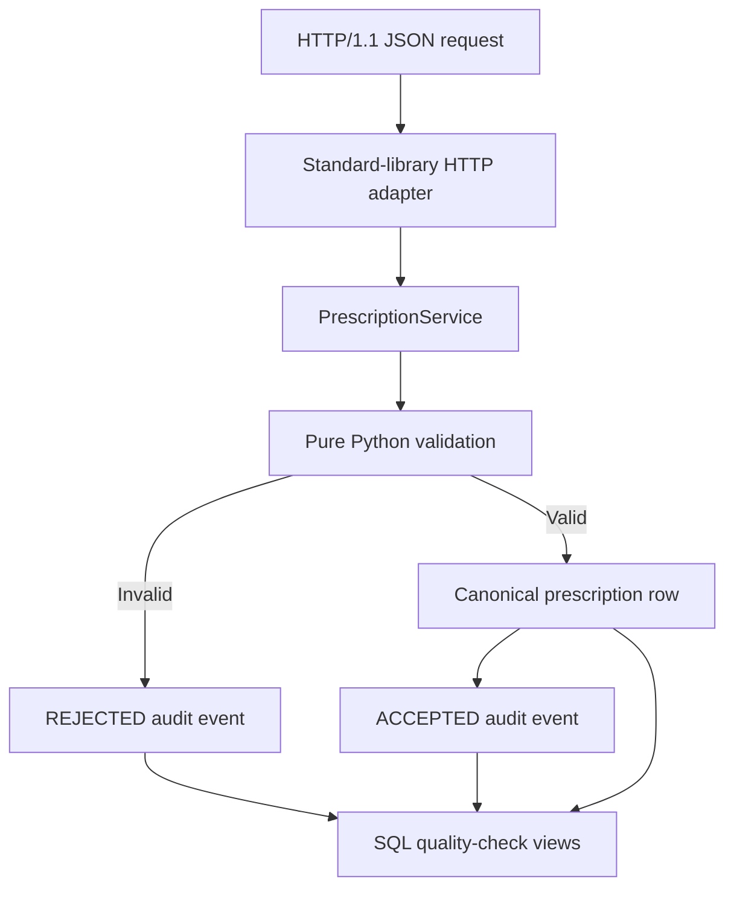

# RxCare v0.1.0 — Architecture and boundaries

## Implemented vertical slice

Version `0.1.0` implements one rule from Jira Story `RXQA-5`:

> A synthetic prescription submission with a missing, empty, or whitespace-only dosage instruction must be rejected and must not enter canonical prescription storage.

The prototype also creates one privacy-safe audit event for every accepted or rejected service-level prescription validation attempt. Transport-level failures, such as malformed JSON that cannot be mapped to a prescription input, are outside this audit claim.

## Components

| Component | Responsibility |
|---|---|
| `models.py` | Small immutable input and validation-result models |
| `validation.py` | Pure business rule: `None`, empty, or `strip() == ''` dosage is invalid |
| `service.py` | Atomic validation, persistence, duplicate handling, and audit-event creation |
| `database.py` | SQLite connections and parameterised repository queries |
| `http_api.py` | Minimal JSON/HTTP contract and optional local listener |
| `schema.sql` | Canonical and audit tables plus database constraints |
| `quality_checks.sql` | Read-only SQL checks for missing dosage and duplicate IDs |

## Data model

### `prescriptions`

Canonical accepted records contain:

- `record_id` — synthetic primary key;
- `patient_ref` — synthetic reference only;
- `medication_name` — fictional test value;
- `dosage_instruction` — required and guarded by a SQLite `CHECK` constraint;
- UTC creation time and application version.

### `validation_events`

Audit events contain only the minimum fields needed for traceability:

- unique attempt and event IDs;
- UTC timestamp;
- fixed action name;
- synthetic record ID;
- `ACCEPTED` or `REJECTED` outcome;
- optional reason code;
- application version.

They deliberately exclude patient reference, medication name, dosage text, and other free text. There is no foreign key to canonical prescriptions because rejected attempts correctly have no canonical record.

## Integrity controls

1. Validation occurs before canonical insertion.
2. Accepted prescription and accepted audit event are written in one transaction.
3. Rejected attempt and rejection audit event are written in one transaction.
4. All values use SQL parameters rather than string interpolation.
5. SQLite repeats the non-blank dosage rule as defence in depth, including common ASCII and Unicode whitespace recognized by Python's `strip()`.
6. `record_id` is a primary key; a duplicate receives a controlled `409` response and does not overwrite the original.

## HTTP contract

| Method and path | Result |
|---|---|
| `GET /health` | Version and local-prototype status |
| `POST /api/v1/prescriptions` | `201` accepted, `422` validation rejection, or `409` duplicate ID |
| `GET /api/v1/prescriptions/{record_id}` | Canonical-record verification |
| `GET /api/v1/audit-events?record_id=...` | Sanitized audit verification |
| `GET /api/v1/quality-checks` | SQL finding counts and audit totals |

## Explicit non-claims

Version `0.1.0` does not implement or claim a user interface, authentication or RBAC, encryption review, clinical validation, regulatory compliance, AI functionality, production deployment, FastAPI, ORM use, or broad prescription-validation coverage. Those are separate future increments.
