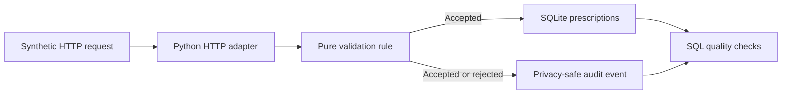

# RxCare HealthTech QA Case Study

An independent HealthTech QA and data-validation case study created and maintained by **Dimitrios Mezes**.

RxCare now contains one working, reproducible vertical slice: a local Python service validates the dosage-completeness rule in `RXQA-5`, persists accepted synthetic records in SQLite, creates privacy-safe audit events for service-level prescription validation attempts, exposes a small HTTP contract, and produces structured execution evidence.

## Product and scope

RxCare is a fictional medication-management and e-prescription quality application. The project translates healthcare-domain risks into testable requirements, structured test design, executable validation, SQL controls, traceability, and evidence-backed reporting.

Only synthetic data is used. The repository contains no real patient, prescription, pharmacy, employer, client, or production information.

## Verified status — v0.1.0

| Capability | Status | Evidence |
|---|---|---|
| Jira story, acceptance criteria, and four UI-oriented manual test designs | Designed — UI tests remain **Not Executed** | [Jira evidence](#jira-evidence), [manual cases](MANUAL_TEST_CASES_RXQA-5.md) |
| Python dosage-completeness validation | Implemented and executed | [`src/rxcare/validation.py`](src/rxcare/validation.py), [test output](evidence/execution/20260817T185026Z-v0.1.0/automated_test_output.txt) |
| SQLite canonical storage and privacy-safe audit log | Implemented and executed | [`sql/schema.sql`](sql/schema.sql), [sanitized audit evidence](evidence/execution/20260817T185026Z-v0.1.0/sanitized_audit_events.json) |
| Parameterised SQL and quality checks | Implemented and executed | [`sql/quality_checks.sql`](sql/quality_checks.sql), [query results](evidence/execution/20260817T185026Z-v0.1.0/quality_checks.json) |
| Local HTTP request/response contract | Implemented; handler contract executed in-process | [`src/rxcare/http_api.py`](src/rxcare/http_api.py), [API cases](API_TEST_CASES_RXQA-5.md) |
| Automated unit, integration, database, and HTTP-handler tests | **16/16 Passed** | [JUnit XML](evidence/execution/20260817T185026Z-v0.1.0/junit.xml) |
| Live TCP-port smoke test | **Not Executed** in the restricted sprint environment | [run metadata](evidence/execution/20260817T185026Z-v0.1.0/run_metadata.json), [local runbook](RUNBOOK_GR.md) |
| RXQA-10 whitespace candidate risk | **Not reproduced on v0.1.0**; not a confirmed defect | [assessment](BUG_REPORT_RXQA-10.md) |
| UI, authentication/RBAC, FastAPI migration, large synthetic dataset, broader medication rules, and deployment | Planned — not claimed as implemented | [methodology](PROJECT_METHODOLOGY.md) |

## First execution result

The evidence run `20260817T185026Z-v0.1.0` passed:

- empty dosage rejected with HTTP 422;
- whitespace-only dosage rejected with HTTP 422;
- rejected submissions absent from canonical storage;
- valid dosage persisted without alteration;
- exactly one privacy-safe audit event created per service-level prescription validation attempt;
- duplicate record ID rejected with HTTP 409;
- SQLite independently blocked a direct whitespace-only insert;
- all four canonical-data SQL quality checks returned zero findings;
- 16 automated tests passed.

Start with the [execution report](TEST_EXECUTION_REPORT.md) and follow its links to the raw, synthetic evidence package.

## Architecture



The implementation uses Python's standard library only so the first slice can be reproduced without downloading packages. FastAPI is deliberately listed as a later milestone, not as a current capability. See [ARCHITECTURE.md](ARCHITECTURE.md) for the design decisions and boundaries.

## Reproduce locally

```bash
PYTHONPATH=src python3 -m unittest discover -s tests -v
PYTHONPATH=src python3 scripts/capture_execution_evidence.py
PYTHONPATH=src python3 -m rxcare --database runtime/rxcare.db
```

The third command starts the optional local listener on `http://127.0.0.1:8000`. Greek step-by-step instructions and example requests are in [RUNBOOK_GR.md](RUNBOOK_GR.md).

## Jira evidence

The screenshots document the private Jira Cloud implementation. Only selected privacy-reviewed views are published.

### Project workspace and Board navigation


### Story acceptance criteria


### Manual test design


### Candidate-risk status and traceability


The screenshot records remain evidence of the earlier design state. The later executable result is documented separately: RXQA-10 was not reproduced on v0.1.0.

## Repository guide

| Artifact | Purpose |
|---|---|
| [ARCHITECTURE.md](ARCHITECTURE.md) | Executable slice, data flow, privacy boundary, and design decisions |
| [RUNBOOK_GR.md](RUNBOOK_GR.md) | Greek reproduction and local execution guide |
| [API_TEST_CASES_RXQA-5.md](API_TEST_CASES_RXQA-5.md) | Executed API-contract cases and evidence links |
| [TEST_EXECUTION_REPORT.md](TEST_EXECUTION_REPORT.md) | Latest verified execution summary |
| [TRACEABILITY_MATRIX.md](TRACEABILITY_MATRIX.md) | Requirement-to-design-to-execution coverage |
| [MANUAL_TEST_CASES_RXQA-5.md](MANUAL_TEST_CASES_RXQA-5.md) | Four UI-oriented test designs, still Not Executed |
| [BUG_REPORT_RXQA-10.md](BUG_REPORT_RXQA-10.md) | Candidate-risk assessment and not-reproduced result |
| [PROJECT_METHODOLOGY.md](PROJECT_METHODOLOGY.md) | Evidence rules, current scope, and planned coverage |
| [SYNTHETIC_DATA_POLICY.md](SYNTHETIC_DATA_POLICY.md) | Privacy-safe fictional-data rules |
| [EVIDENCE_POLICY.md](EVIDENCE_POLICY.md) | Publication and integrity controls |

## Ownership and integrity

Every published artifact is intended to be understood, explained, and reproduced by the author. Portfolio practice is not represented as prior professional QA employment. A designed test is not described as executed, an unobserved risk is not described as a defect, and a local prototype is not described as a clinical or production system.

## Disclaimer

RxCare is a fictional educational product. It is not associated with a healthcare provider, pharmacy, employer, or commercial platform and does not provide medical advice.
